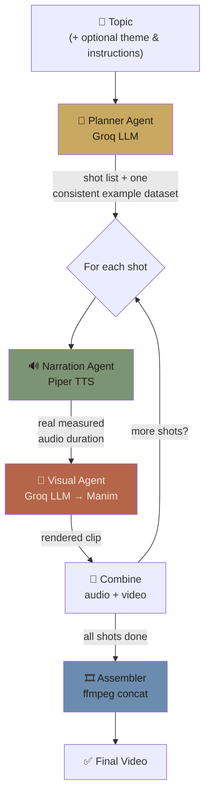
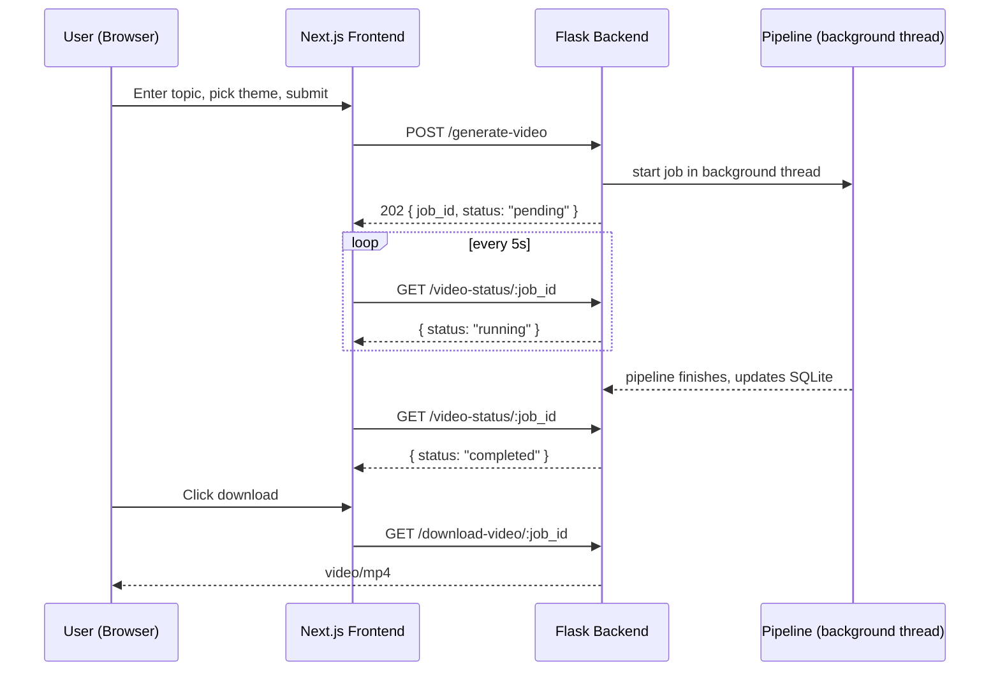

# 🎬 Study-Material-to-Video Agent

<p align="center">
  
  
  
  
  
</p>

<p align="center">
  <b>An agentic AI system that turns a topic into a complete, narrated explainer video — no scripting, recording, or editing required.</b>
</p>

<p align="center">
  Give it <code>"Two Sum using a hash map"</code>. Get back a planned, narrated, animated video.
</p>

---

## 📺 Demo

| Light theme | Dark theme |
|---|---|
| 🎥 [Watch (light)](#) | 🎥 [Watch (dark)](#) |

*Replace both links above with your uploaded videos — either upload the `.mp4` files directly to the repo (e.g. in a `/demo` folder, GitHub renders them inline) or link to YouTube (unlisted is fine).*

> **🌐 [Live frontend](#)** — *your Vercel URL* — the UI is deployed and browsable; see [Deployment Status](DEPLOYMENT.md) for why video generation isn't live on it.

---

## ⚠️ Deployment Status

| Component | Status |
|---|---|
| Frontend (Vercel) | ✅ Deployed and live |
| Backend (video pipeline) | ⚠️ Not currently deployed publicly — runs fully locally / via Docker |

The backend needs more memory than most free hosting tiers provide. Full details, evidence, and how to run it yourself → **[DEPLOYMENT.md](DEPLOYMENT.md)**

---

## 🧠 How It Works

This is a genuine **multi-agent pipeline** — four specialist agents chained in a fixed sequence, each handling a fundamentally different kind of work, orchestrated with LangGraph.



| Agent | Job | Tech |
|---|---|---|
| **Planner** | Breaks the topic into 3-6 shots with a real pedagogical arc (hook → definition → example → recap). Commits to **one concrete example dataset** up front that every shot must reuse — this is the fix that stopped shots from drifting into unrelated examples or even different topics. | Groq (`openai/gpt-oss-120b`) |
| **Narration** | Synthesizes real speech per shot and measures the *actual* audio duration — used to pace the Visual Agent, not the Planner's word-count guess. | [Piper TTS](https://github.com/OHF-Voice/piper1-gpl) — fully local, zero-cost |
| **Visual** | Generates Manim scene code per shot and renders it, retrying with the real error fed back to the LLM on failure. | Groq LLM → [Manim Community](https://www.manim.community/) |
| **Assembler** | Combines each shot's audio+video, then concatenates every shot into the final file. | Direct `ffmpeg` calls |

### Why narration runs *before* visuals
The Visual Agent paces its Manim animation against Piper's **actual measured** duration, not the Planner's rough word-count estimate — so the video never runs noticeably short or long against the spoken narration.

### The async job flow



A full render takes several minutes, so the backend returns a `job_id` immediately instead of holding the HTTP connection open — the frontend polls for status rather than waiting on one long request.

---

## ✨ Features

- 🌗 **Light/dark theme** — for the website itself *and* independently for the generated video's own visual style
- ✍️ **Optional custom instructions** — steer tone or visual style per video (*"keep it beginner-friendly"*, *"avoid highlight boxes"*) without touching code; ignored gracefully if left blank
- 🎯 **Consistent example data** — the Planner commits to one dataset for the whole video, preventing topic drift and abstract/generic visuals
- 🔁 **Self-correcting renders** — the Visual Agent retries failed Manim renders with the real error message fed back to the LLM
- 📊 **Async job queue** with clean status polling (`pending` → `running` → `completed`/`failed`)

---

## 🛠️ Tech Stack

**Backend** — Flask · LangGraph · Groq · Manim Community · Piper TTS · ffmpeg · SQLite
**Frontend** — Next.js 14 · TypeScript · Tailwind CSS

---

## 🚀 Setup

### Backend
```bash
cd backend
pip install -r requirements.txt --break-system-packages
cp .env.example .env   # add your GROQ_API_KEY
python app.py
```
Requires `ffmpeg` and Manim's system dependencies (Cairo, Pango) on PATH. On Windows, make sure your virtual environment is active in *every* terminal — Manim and ffmpeg both need to resolve from inside it.

### Frontend
```bash
cd frontend
npm install
cp .env.local.example .env.local
npm run dev
```
Open `http://localhost:3000`. Start the backend first.

### Or run the whole backend via Docker (recommended — matches the deploy environment exactly)
```bash
cd backend
docker build -t study-video-agent .
docker run -p 5000:5000 --env-file .env study-video-agent
```

---

## 📡 API

| Endpoint | Method | Purpose |
|---|---|---|
| `/generate-video` | POST | Start a job. Body: `{ topic, theme?, instructions? }`. Returns `{ job_id, status }` immediately (202). |
| `/video-status/<job_id>` | GET | Poll status: `pending` / `running` / `completed` / `failed` (+ `error` if failed). |
| `/download-video/<job_id>` | GET | Download the finished `.mp4` once completed. |

---

## 🏗️ Design Decisions

- **ffmpeg over MoviePy** for final assembly — MoviePy silently dropped audio during multi-clip concatenation and crashed reading frames near a video's end during development. Direct `ffmpeg` subprocess calls replaced it entirely.
- **SQLite over an in-memory dict** for job tracking — a production WSGI server can run multiple worker processes with separate memory; SQLite is a shared file every worker can read.
- **Sequential pipeline over dynamic agent routing** — every request needs the same fixed Plan → Narrate+Visualize → Assemble sequence, so there's no LLM decision about *which* agent to call next. A simpler, equally legitimate multi-agent pattern for a workflow that doesn't vary.
- **One gunicorn worker, deliberately** — background threads + SQLite status tracking only stay correct with a single process; more workers would split job state across processes that can't see each other's in-flight threads.

---

## 🐞 Known Limitations

This was a first project building a code-generating multi-agent pipeline, and testing surfaced real, worth-documenting failure modes rather than hiding them:

- **Occasional visual rendering issues** — since the retry loop only verifies a Manim render *succeeds*, not that it *looks* correct, some shots have shipped with overlapping text (when a value updates multiple times in one shot), near-invisible low-contrast text, content clipped outside the frame, or disproportionately sized highlight boxes. Each was found, root-caused, and addressed with more explicit rendering rules as testing uncovered it — several are meaningfully improved from earlier versions, but a fully code-generating visual pipeline can't yet guarantee every render is visually perfect the way a schema check guarantees valid JSON. This is an open problem for this class of system generally.
- **No production-grade job recovery** — if the process running a job's background thread crashes mid-render, that job is permanently stuck at `running`. A real task queue (Celery/RQ) would fix this; threading + SQLite was a deliberate, documented tradeoff for this project's scope.
- **Text-only input** — PDF/document upload is planned but not built.
- **Backend not publicly deployed** — see [DEPLOYMENT.md](DEPLOYMENT.md).

---

## 🗺️ Roadmap

- [ ] PDF/document upload as an alternative to a typed topic
- [ ] Further harden the Visual Agent prompt against remaining overlap/positioning edge cases
- [ ] Production job queue (Celery/RQ) for crash recovery
- [ ] Backend deployment on a tier with sufficient memory

---

## 📄 License

MIT
